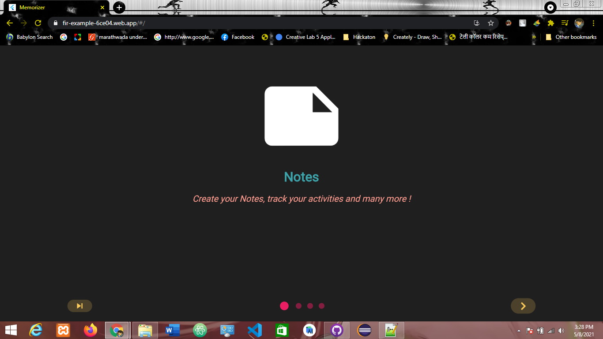
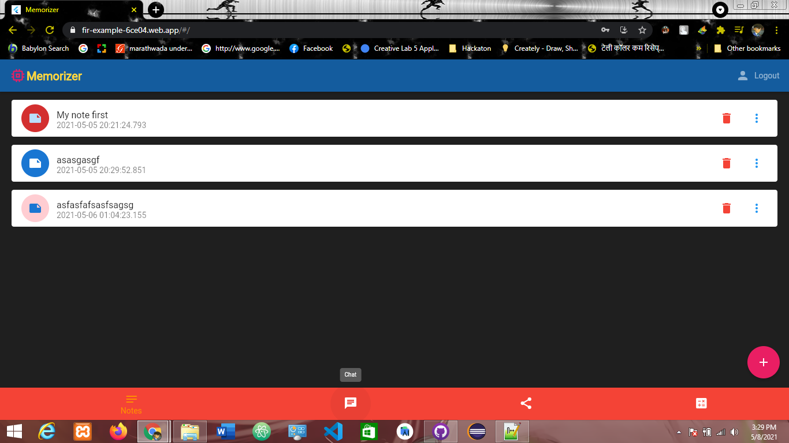

# Memorizer-Flutter_Web_App

A open-source flutter project designed with Firebase Firestore as backend,hosted with Firebase hosting. It uses native flutter dart designs for UI.

The web is implemented with multiple functionalities such as saving users notes, chatting with friends, maintaining story board, making advance calculations and many more !

# Demo Live Web App URL https://fir-example-6ce04.web.app/#/

## Getting Started
**Note:** Make sure your Flutter environment is setup.

#### Installation

In the command terminal, run the following commands:

    $ git clone git@github.com:VARADSP/Memorizer.git
    $ cd Memorizer/
    $ flutter run

# Simulate for iOS
#### Method One
    
    Open the project in Xcode from ios/Runner.xcodeproj.
    Hit the play button.

#### Method Two

    Run the following command in your terminal.
    $ open -a Simulator
    $ flutter run

# Simulate for Android

    Make sure you have an Android emulator installed and running.
    Run the following command in your terminal.
    $ flutter run

##### Check out Flutter’s online [documentation](http://flutter.io/) for help getting start with your Flutter project.

